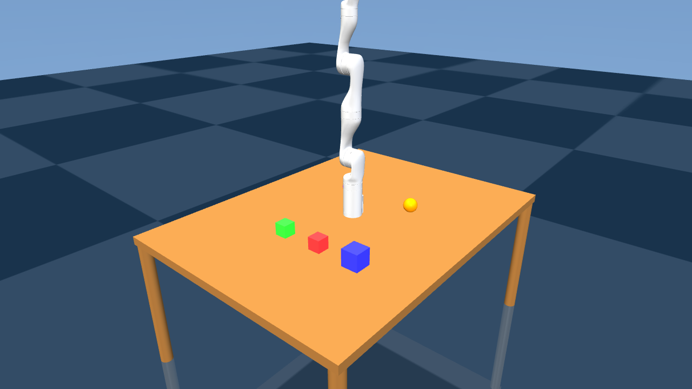
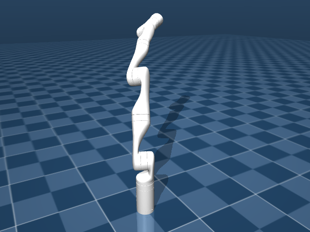

# mj-kdl-wrapper

A C++ library that integrates [MuJoCo 3.5](https://github.com/google-deepmind/mujoco) physics simulation with [KDL](https://github.com/orocos/orocos_kinematics_dynamics) for robot kinematic and dynamic computations.

## Simulation Preview



*7-DOF arm mounted on a table with pickable cubes and spheres — KDL gravity compensation, free-floating objects, rendered with MuJoCo 3.5.*



*Kinova GEN3 7-DOF arm — gravity compensation with interactive force perturbation.*

## Features

- **URDF loading** — converts URDF to MJCF, auto-injects scene elements (floor, lights)
- **KDL chain** — builds a KDL chain from URDF via bundled `kdl_parser`; FK, IK, Jacobian, dynamics
- **Multi-robot scenes** — place multiple robots in one shared simulation via `SceneSpec`/`build_scene`
- **Table** — add a parametric table (`TableSpec`) and mount arm(s) on it
- **Scene objects** — declare boxes, spheres, and cylinders (`SceneObject`) on the table for the arm to pick; add or remove at runtime via `scene_add_object` / `scene_remove_object`
- **Real-time rendering** — GLFW window with mouse camera control and interactive force perturbation
- **State sync** — bidirectional sync between MuJoCo `qpos`/`qfrc_applied` and KDL joint arrays
- **Thin API** — plain structs and free functions; `model` and `data` are direct public fields

## Dependencies

| Dependency | Version | Install |
|------------|---------|---------|
| MuJoCo | 3.5.0 | download to `/opt/mujoco-3.5.0` |
| GLFW | 3.x | `sudo apt install libglfw3-dev` |
| OpenGL | — | `sudo apt install libgl-dev` |
| orocos-kdl | — | `sudo apt install liborocos-kdl-dev` |
| urdfdom | — | `sudo apt install liburdfdom-dev` |
| TinyXML2 | — | `sudo apt install libtinyxml2-dev` |

`kdl_parser` is bundled under `third_party/` — no separate install needed.

## Building

```bash
# 1. Download MuJoCo 3.5.0
wget https://github.com/google-deepmind/mujoco/releases/download/3.5.0/mujoco-3.5.0-linux-x86_64.tar.gz
tar -xzf mujoco-3.5.0-linux-x86_64.tar.gz -C /opt/

# 2. Install system deps
sudo apt install libglfw3-dev libgl-dev liborocos-kdl-dev liburdfdom-dev libtinyxml2-dev

# 3. Configure and build
mkdir build && cd build
cmake .. -DCMAKE_BUILD_TYPE=RelWithDebInfo
make -j$(nproc)
```

## API

### Single robot

```cpp
#include "mj_kdl_wrapper/mj_kdl_wrapper.hpp"

mj_kdl::Config cfg;
cfg.urdf_path = "robot.urdf";
cfg.base_link = "base_link";
cfg.tip_link  = "ee_link";

mj_kdl::State s;
mj_kdl::init(&s, &cfg);

while (mj_kdl::is_running(&s)) {
    KDL::JntArray q;
    mj_kdl::sync_to_kdl(&s, q);
    mj_kdl::set_torques(&s, tau);
    mj_kdl::step(&s);
    mj_kdl::render(&s);
}
mj_kdl::cleanup(&s);
```

### Robot on a table with pickable objects

```cpp
mj_kdl::SceneSpec spec;

// Table: surface at z = 0.7 m
mj_kdl::TableSpec& t = spec.table;
t.enabled      = true;
t.pos[2]       = 0.7;          // table surface height
t.top_size[0]  = 0.8;          // half-extent x
t.top_size[1]  = 0.6;          // half-extent y
t.thickness    = 0.04;
t.leg_radius   = 0.03;
// t.rgba = {0.55, 0.37, 0.18, 1}  — default wood-brown

// Robot mounted at table surface
mj_kdl::SceneRobot robot;
robot.urdf_path = "robot.urdf";
robot.pos[2]    = t.pos[2];    // base on table surface
spec.robots.push_back(robot);

// Objects resting on the table
// size: BOX→half-extents, SPHERE→{radius,0,0}, CYLINDER→{radius,half-len,0}
// pos[2] = surface_z + half-height so the object rests on the surface
mj_kdl::SceneObject cube;
cube.name    = "red_cube";
cube.shape   = mj_kdl::ObjShape::BOX;
cube.size[0] = cube.size[1] = cube.size[2] = 0.03;
cube.pos[0]  = 0.35; cube.pos[1] = 0.1; cube.pos[2] = t.pos[2] + 0.03;
cube.rgba[0] = 1.0f; cube.rgba[1] = 0.2f; cube.rgba[2] = 0.2f; cube.rgba[3] = 1.0f;
spec.objects.push_back(cube);

mj_kdl::SceneObject sphere;
sphere.name    = "ball";
sphere.shape   = mj_kdl::ObjShape::SPHERE;
sphere.size[0] = 0.04;          // radius
sphere.pos[0]  = -0.2; sphere.pos[1] = 0.2; sphere.pos[2] = t.pos[2] + 0.04;
sphere.rgba[0] = 0.2f; sphere.rgba[1] = 0.6f; sphere.rgba[2] = 1.0f; sphere.rgba[3] = 1.0f;
spec.objects.push_back(sphere);

mjModel* model; mjData* data;
mj_kdl::build_scene(&model, &data, &spec);

mj_kdl::State s;
mj_kdl::init_robot(&s, model, data, "robot.urdf", "base_link", "ee_link");
```

### Runtime add / remove objects

Objects can be added or removed at runtime. The model is recompiled; any
`State` objects holding the old model/data become stale and must be
re-initialised with `init_robot()`.

```cpp
// Add a new object
mj_kdl::SceneObject extra;
extra.name = "yellow_cube";
extra.shape = mj_kdl::ObjShape::BOX;
extra.size[0] = extra.size[1] = extra.size[2] = 0.025;
extra.pos[0] = 0.0; extra.pos[1] = 0.4; extra.pos[2] = surface_z + 0.025;
mj_kdl::scene_add_object(&model, &data, &spec, extra);
// model and data now point to the newly compiled scene

// Remove an object by name
mj_kdl::scene_remove_object(&model, &data, &spec, "yellow_cube");
```

### KDL gravity compensation

```cpp
KDL::ChainDynParam dyn(s.chain, KDL::Vector(0, 0, -9.81));

while (mj_kdl::is_running(&s)) {
    KDL::JntArray q, g(s.n_joints);
    mj_kdl::sync_to_kdl(&s, q);
    dyn.JntToGravity(q, g);
    mj_kdl::set_torques(&s, g);
    mj_kdl::step(&s);
    mj_kdl::render(&s);
}
```

### Multi-robot scene

```cpp
mj_kdl::SceneSpec spec;
spec.robots = {
    {"arm1.urdf", "",    {-0.5, 0, 0}, {0, 0,   0}},
    {"arm2.urdf", "r2_", { 0.5, 0, 0}, {0, 0, 180}},
};

mjModel* model; mjData* data;
mj_kdl::build_scene(&model, &data, &spec);

mj_kdl::State arm1, arm2;
mj_kdl::init_robot(&arm1, model, data, "arm1.urdf", "base_link", "ee_link", "");
mj_kdl::init_robot(&arm2, model, data, "arm2.urdf", "base_link", "ee_link", "r2_");
```

## Tests

| Binary | What it tests |
|--------|---------------|
| `test_init` | URDF load, DOF count, simulation advance |
| `test_velocity` | FK, IK (NR_JL), Jacobian |
| `test_gravity_comp` | KDL gravity torques vs MuJoCo at q=0; EE drift over 500 steps |
| `test_dual_arm` | Two robots in one shared scene; KDL gravity comp per arm; EE drift < 1 mm |
| `test_table_scene` | Robot on table + 3 cubes + 2 spheres; gravity comp; runtime add/remove objects |

```bash
cd build
./test_init          ../urdf/GEN3_URDF_V12.urdf
./test_velocity      ../urdf/GEN3_URDF_V12.urdf
./test_gravity_comp  ../urdf/GEN3_URDF_V12.urdf
./test_dual_arm      ../urdf/GEN3_URDF_V12.urdf
./test_table_scene   ../urdf/GEN3_URDF_V12.urdf

# GUI mode — opens a GLFW window (robot holds pose, objects can be perturbed)
./test_gravity_comp  ../urdf/GEN3_URDF_V12.urdf --gui
./test_dual_arm      ../urdf/GEN3_URDF_V12.urdf --gui
./test_table_scene   ../urdf/GEN3_URDF_V12.urdf --gui
```

### GUI controls

| Input | Action |
|-------|--------|
| Left drag | Orbit camera |
| Right drag | Pan camera |
| Scroll | Zoom |
| **Ctrl + Right drag** | **Push body (translational spring force)** |
| **Ctrl + Left drag** | **Rotate body (torque)** |
| `ESC` / `Q` | Quit |

## Project Structure

```
mj-kdl-wrapper/
├── include/mj_kdl_wrapper/
│   └── mj_kdl_wrapper.hpp   # structs and function declarations
├── src/
│   └── mj_kdl_wrapper.cpp   # all implementation
├── test/
│   ├── test_init.cpp
│   ├── test_velocity.cpp
│   ├── test_gravity_comp.cpp
│   ├── test_dual_arm.cpp
│   └── test_table_scene.cpp
├── third_party/
│   └── kdl_parser/          # bundled ros/kdl_parser (jazzy, rcutils stripped)
└── urdf/
    └── GEN3_URDF_V12.urdf
```
