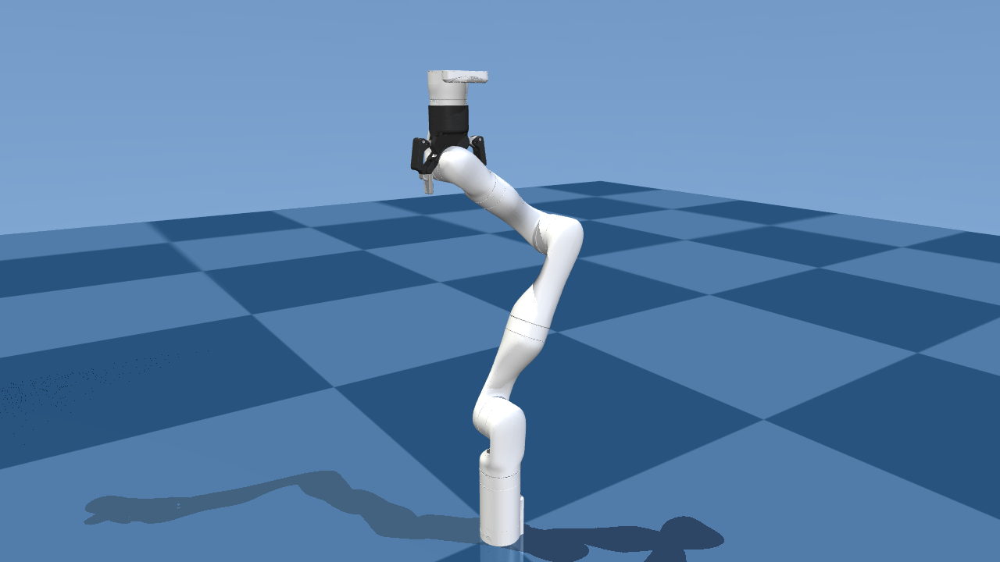

# mj-kdl-wrapper

A C++ library bridging [MuJoCo 3.5](https://github.com/google-deepmind/mujoco) physics simulation with [KDL](https://github.com/orocos/orocos_kinematics_dynamics) for robot kinematics and dynamics.

## Preview



*Kinova GEN3 7-DOF arm with Robotiq 2F-85 gripper — loaded directly from MuJoCo menagerie MJCF.*


*7-DOF arm on a table with pickable cubes and spheres — KDL gravity compensation.*

## Features

- **MJCF loading** — load MuJoCo models directly with `load_mjcf` + `init_from_mjcf`; no URDF needed
- **URDF loading** — converts URDF to MJCF, auto-injects scene elements (floor, lights)
- **KDL chain** — builds a KDL chain from URDF or MJCF; FK, IK, Jacobian, dynamics
- **Gripper attachment** — combine arm + gripper MJCF with `attach_gripper`; handles name prefixing, mesh paths, connect constraints
- **Multi-robot scenes** — place multiple robots in one shared simulation via `SceneSpec`/`build_scene`
- **Table + objects** — parametric table, boxes, spheres, cylinders; add/remove objects at runtime
- **Interactive viewer** — GLFW window with joint value overlay, pause/resume, body selection for force perturbation

## Dependencies

| Dependency | Version | Install |
|------------|---------|---------|
| MuJoCo | 3.5.0 | download to `/opt/mujoco-3.5.0` |
| GLFW | 3.x | `sudo apt install libglfw3-dev` |
| OpenGL | — | `sudo apt install libgl-dev` |
| orocos-kdl | — | `sudo apt install liborocos-kdl-dev` |
| urdfdom | — | `sudo apt install liburdfdom-dev` |
| TinyXML2 | — | `sudo apt install libtinyxml2-dev` |

`kdl_parser` is bundled under `third_party/` — no separate install needed.

## Building

```bash
wget https://github.com/google-deepmind/mujoco/releases/download/3.5.0/mujoco-3.5.0-linux-x86_64.tar.gz
tar -xzf mujoco-3.5.0-linux-x86_64.tar.gz -C /opt/

sudo apt install libglfw3-dev libgl-dev liborocos-kdl-dev liburdfdom-dev libtinyxml2-dev

mkdir build && cd build
cmake .. -DCMAKE_BUILD_TYPE=RelWithDebInfo
make -j$(nproc)
```

## API

### Load from MJCF (menagerie / MuJoCo format)

```cpp
#include "mj_kdl_wrapper/mj_kdl_wrapper.hpp"

mjModel* model; mjData* data;
mj_kdl::load_mjcf(&model, &data, "assets/kinova_gen3/gen3.xml");

mj_kdl::State s;
mj_kdl::init_from_mjcf(&s, model, data, "base_link", "bracelet_link");
mj_kdl::init_window(&s, "GEN3");

while (mj_kdl::is_running(&s)) {
    KDL::JntArray q, g(s.n_joints);
    mj_kdl::sync_to_kdl(&s, q);
    KDL::ChainDynParam dyn(s.chain, KDL::Vector(0, 0, -9.81));
    dyn.JntToGravity(q, g);
    mj_kdl::set_torques(&s, g);
    mj_kdl::step(&s);
    mj_kdl::render(&s);
}
mj_kdl::cleanup(&s);
```

### Attach a gripper to an arm

```cpp
mj_kdl::GripperSpec gripper;
gripper.mjcf_path = "assets/robotiq_2f85/2f85.xml";
gripper.attach_to = "bracelet_link";
gripper.prefix    = "g_";

mj_kdl::attach_gripper("assets/kinova_gen3/gen3.xml", &gripper, "assets/gen3_with_2f85.xml");

mjModel* model; mjData* data;
mj_kdl::load_mjcf(&model, &data, "assets/gen3_with_2f85.xml");

mj_kdl::State s;
mj_kdl::init_from_mjcf(&s, model, data, "base_link", "bracelet_link");
```

### Load from URDF

```cpp
mj_kdl::Config cfg;
cfg.urdf_path = "assets/gen3_urdf/GEN3_URDF_V12.urdf";
cfg.base_link = "base_link";
cfg.tip_link  = "bracelet_link";

mj_kdl::State s;
mj_kdl::init(&s, &cfg);

while (mj_kdl::is_running(&s)) {
    KDL::JntArray q, g(s.n_joints);
    mj_kdl::sync_to_kdl(&s, q);
    KDL::ChainDynParam dyn(s.chain, KDL::Vector(0, 0, -9.81));
    dyn.JntToGravity(q, g);
    mj_kdl::set_torques(&s, g);
    mj_kdl::step(&s);
    mj_kdl::render(&s);
}
mj_kdl::cleanup(&s);
```

### Robot on a table with objects

```cpp
mj_kdl::SceneSpec spec;
spec.table.enabled = true;
spec.table.pos[2]  = 0.7;

mj_kdl::SceneRobot robot;
robot.urdf_path = "assets/gen3_urdf/GEN3_URDF_V12.urdf";
robot.pos[2]    = 0.7;
spec.robots.push_back(robot);

mj_kdl::SceneObject cube;
cube.name    = "red_cube";
cube.shape   = mj_kdl::ObjShape::BOX;
cube.size[0] = cube.size[1] = cube.size[2] = 0.03;
cube.pos[0]  = 0.35; cube.pos[1] = 0.1; cube.pos[2] = 0.73;
cube.rgba[0] = 1.0f; cube.rgba[1] = 0.2f; cube.rgba[2] = 0.2f; cube.rgba[3] = 1.0f;
spec.objects.push_back(cube);

mjModel* model; mjData* data;
mj_kdl::build_scene(&model, &data, &spec);

mj_kdl::State s;
mj_kdl::init_robot(&s, model, data, "assets/gen3_urdf/GEN3_URDF_V12.urdf",
                   "base_link", "bracelet_link");
```

### Runtime add / remove objects

```cpp
mj_kdl::scene_add_object(&model, &data, &spec, obj);
mj_kdl::scene_remove_object(&model, &data, &spec, "red_cube");
// model/data are replaced; re-call init_robot() afterwards
```

## Viewer

The viewer shows:
- **Top-left**: simulation time, pause state, and selected body name
- **Top-right**: live joint values (toggle with `J`)

### Controls

| Input | Action |
|-------|--------|
| Left drag | Orbit camera |
| Right drag | Pan camera |
| Scroll | Zoom |
| **Double-click body** | **Select body for perturbation** |
| **Left drag** (selected) | **Apply translational force** |
| **Right drag** (selected) | **Apply torque** |
| `D` | Deselect body |
| `Space` | Pause / resume |
| `R` | Reset simulation |
| `J` | Toggle joint value overlay |
| `Q` / `Esc` | Quit |

`State::paused` and `State::show_joints` can also be set programmatically.

## Tests

| Binary | What it tests |
|--------|---------------|
| `test_init` | URDF load, DOF count, simulation advance |
| `test_velocity` | FK, IK (NR_JL), Jacobian |
| `test_gravity_comp` | KDL gravity torques vs MuJoCo at q=0; EE drift over 500 steps |
| `test_dual_arm` | Two robots in one shared scene; gravity comp per arm |
| `test_table_scene` | Robot + table + objects; runtime add/remove |
| `test_kinova_gen3_menagerie` | MJCF load from menagerie; KDL chain; gravity accuracy |
| `test_kinova_gen3_gripper` | `attach_gripper`; combined model structure; joint ranges |

```bash
./build/test_init assets/gen3_urdf/GEN3_URDF_V12.urdf
./build/test_velocity assets/gen3_urdf/GEN3_URDF_V12.urdf
./build/test_gravity_comp assets/gen3_urdf/GEN3_URDF_V12.urdf
./build/test_kinova_gen3_menagerie
./build/test_kinova_gen3_gripper

# GUI mode
./build/test_gravity_comp --gui
./build/test_dual_arm --gui
./build/test_table_scene --gui
```

## Assets

| Path | Description |
|------|-------------|
| `assets/kinova_gen3/gen3.xml` | Kinova GEN3 7-DOF arm (MuJoCo menagerie) |
| `assets/robotiq_2f85/2f85.xml` | Robotiq 2F-85 gripper (MuJoCo menagerie) |
| `assets/gen3_with_2f85.xml` | Combined arm + gripper (generated by `attach_gripper`) |
| `assets/gen3_urdf/GEN3_URDF_V12.urdf` | Kinova GEN3 URDF |
| `assets/scene.xml` | Minimal scene template (floor + skybox + lights) |

## Regenerate screenshots

```bash
MUJOCO_GL=egl python3 tools/render_gripper_scene.py
MUJOCO_GL=egl python3 tools/render_table_scene.py
```
