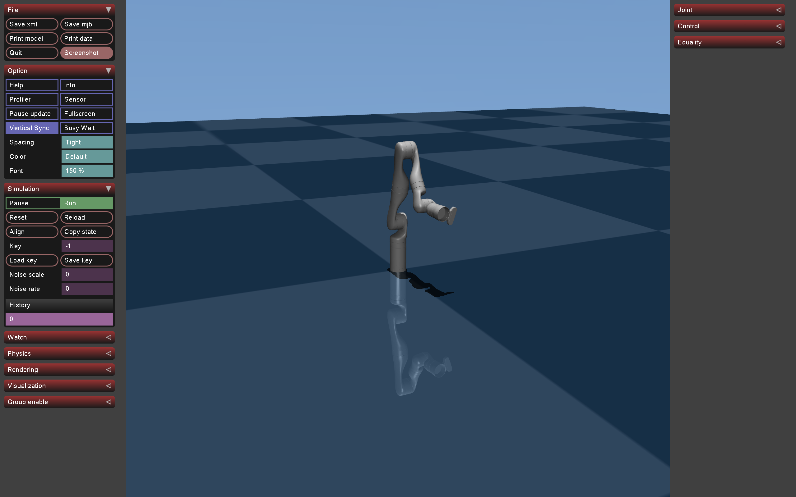
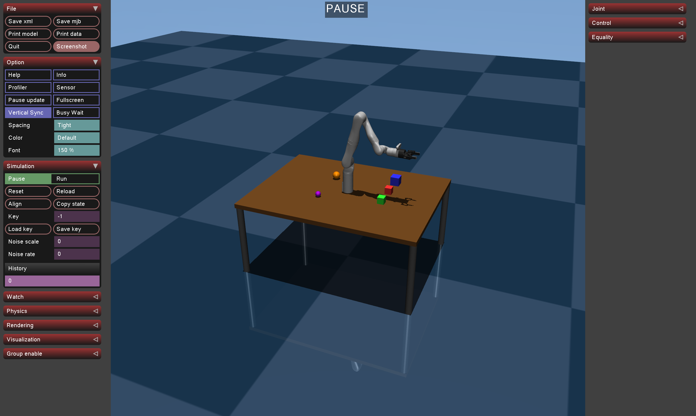
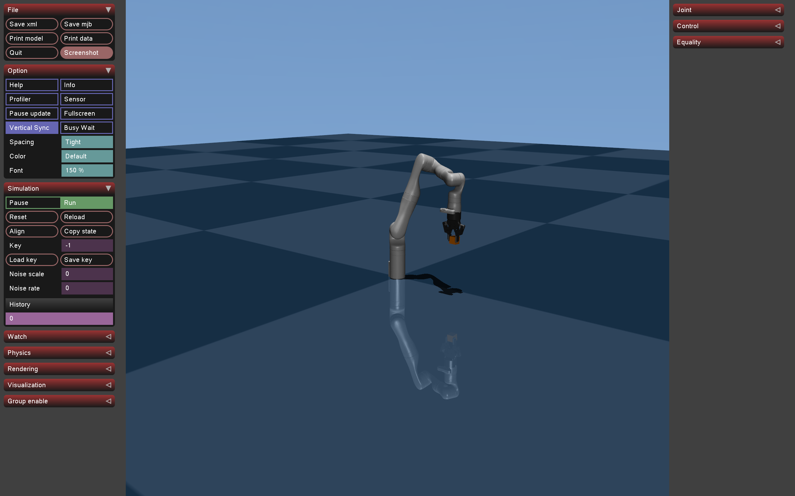
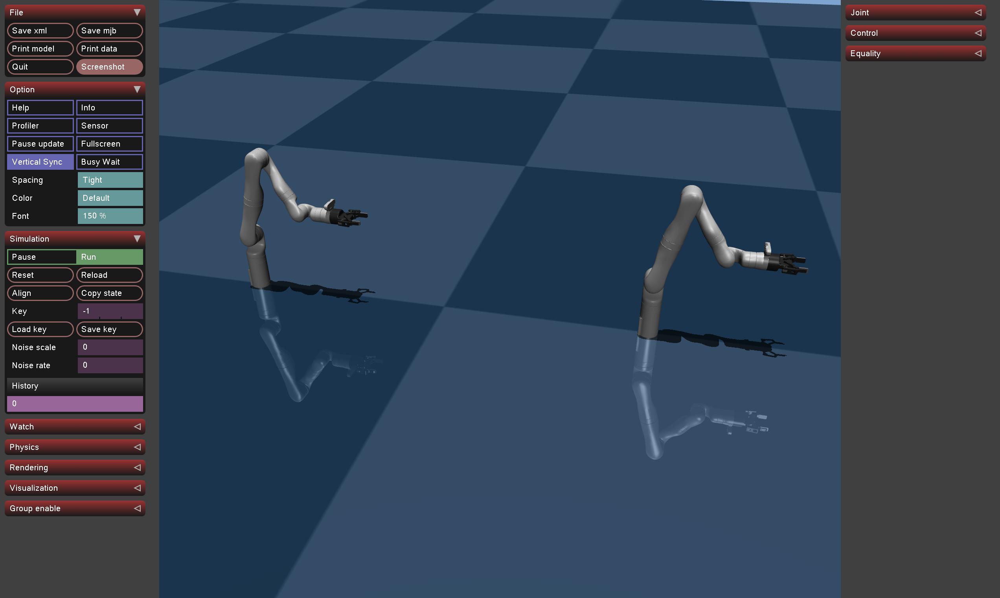

# Mujoco KDL Wrapper

A C++ library bridging [MuJoCo](https://github.com/google-deepmind/mujoco) physics simulation with [KDL](https://github.com/orocos/orocos_kinematics_dynamics) for robot kinematics and dynamics.

## Screenshots

<table>
<tr>
  <td align="center"><br/><b>ex_gravity_comp</b> &mdash; Single arm, KDL gravity compensation</td>
  <td align="center"><br/><b>ex_table_scene</b> &mdash; Arm + table + scene objects</td>
</tr>
<tr>
  <td align="center"><br/><b>ex_pick</b> &mdash; Pick-and-place with Robotiq 2F-85</td>
  <td align="center"><br/><b>ex_dual_arm</b> &mdash; Dual arm + grippers</td>
</tr>
</table>

## Features

- **Scene builder** -- compose MJCF robots, grippers, objects, and cameras into one
  MuJoCo scene via `mjSpec`, with ordered attachment chains and relative placement.
- **Multi-robot** -- multiple robots with independent KDL chains in one simulation.
- **KDL from the model** -- builds the KDL chain directly from the compiled MuJoCo model.
- **Control** -- POSITION / TORQUE ports plus KDL FK, IK, RNEA, and ACHD solvers.
- **Runtime environments** -- `Env` with reset hooks for task setup and replay.
- **Interactive viewer** -- MuJoCo simulate UI with Frames / Trace / Perturb panels
  and overlay lines.
- **Recording** -- interactive and headless EGL + ffmpeg MP4 capture.
- **Python bindings** -- the same API from Python via `pip install`, returning PyKDL types.

## Install

Ubuntu/Debian instructions. Supported dependency versions are listed below.
CMake checks `mjVERSION_HEADER` and stops if `MJ_KDL_MUJOCO_DIR` points at an
unsupported MuJoCo release.

### Dependency Versions

| Dependency | Version / source | Notes |
|------------|------------------|-------|
| MuJoCo | `3.9.0` from `cmake/Versions.cmake` | Native library and pinned `mujoco` Python package must match |
| Orocos KDL | secorolab fork, `feature/achd_fixed_joint` | Built from source; system `liborocos-kdl` is not used |
| CMake | `>=3.16` | Required to configure the C++ build |
| C++ compiler | C++20-capable | `CMAKE_CXX_STANDARD` is set to 20 |
| Python | `>=3.10` | Required for the Python package |
| scikit-build-core | `>=0.11.2` | Python build backend |
| pybind11 | `>=2.13` | Python binding build dependency |

### System packages

```bash
sudo apt update
sudo apt install \
  cmake g++ git python3-dev python3-pip python3-venv \
  libeigen3-dev libglfw3-dev libgl-dev libegl-dev \
  ffmpeg doxygen
```

### C++ library, examples, and tests

```bash
git clone https://github.com/vamsikalagaturu/mj_kdl_wrapper.git
cd mj_kdl_wrapper
cmake -B build \
  -DCMAKE_BUILD_TYPE=RelWithDebInfo \
  -DMJ_KDL_FETCH_MUJOCO=ON \
  -DMJ_KDL_FETCH_OROCOS_KDL=ON \
  -DMJ_KDL_FETCH_MENAGERIE=ON
cmake --build build --parallel $(nproc)
ctest --test-dir build --output-on-failure
```

The three fetch flags are all ON by default; they are shown above to make the
sources explicit:

- `MJ_KDL_FETCH_MUJOCO` downloads the supported MuJoCo release unless
  `MJ_KDL_MUJOCO_DIR` points at an install.
- `MJ_KDL_FETCH_OROCOS_KDL` clones and builds the secorolab Orocos KDL fork - the
  only KDL used; no system `liborocos-kdl` is consulted.
- `MJ_KDL_FETCH_MENAGERIE` downloads the Kinova GEN3 models the examples and
  tests use. The Robotiq gripper is bundled under `assets/robotiq_2f85`.

Point any of these at custom locations with the CMake options below. Install for
use from another CMake project via
`find_package(mj_kdl_wrapper)` (add `-DCMAKE_INSTALL_PREFIX="$HOME/.local"` for a
user-local prefix):

```bash
cmake --install build
```

### Python Install

Install into an active supported Python environment. The build bundles the
native dependencies (MuJoCo, the secorolab Orocos KDL fork, and PyKDL); see the
[Python Bindings API Guide](docs/api/python.md) for what it does and how model
paths are resolved.

```bash
uv pip install "git+https://github.com/vamsikalagaturu/mj_kdl_wrapper.git"  # from GitHub
uv pip install .                                                            # from a checkout
```

Fetch the MuJoCo Menagerie models the examples use (requires `git`), verify, and
run an example from a checkout:

```bash
mj-kdl-fetch-menagerie
python -c "import PyKDL, mujoco, mj_kdl_wrapper as mjk; print(mujoco.mj_versionString(), mjk.mujoco_version())"
python python/examples/ex_gravity_comp.py
```

Use `--dest` to choose the Menagerie checkout location:

```bash
mj-kdl-fetch-menagerie --dest /path/to/menagerie
export MJ_KDL_MENAGERIE=/path/to/menagerie
```

The `python/examples/` scripts are not shipped in the wheel, so run them from a
checkout. Model resolution, environment variables, and using other model sources
are documented in the [Python Bindings API Guide](docs/api/python.md).

### Generate Documentation

```bash
cmake -B build -DBUILD_DOCS=ON
cmake --build build --target docs
```

Open `build/docs/html/index.html`. The generated docs include the C++ headers,
C++ examples, Markdown guides, Python stubs, and Python examples. The docs
target also generates `build/docs/kdl.tag` and `build/docs/html/kdl/` from the
installed Orocos KDL headers so KDL types and common solver calls link locally.

### CMake Options

Paths / sources (override to use your own):

| Flag | Default | Description |
|------|---------|-------------|
| `MJ_KDL_MUJOCO_DIR` | `/opt/mujoco-${MJ_KDL_MUJOCO_VERSION}` | Existing MuJoCo install to use |
| `MJ_KDL_FETCH_MUJOCO` | `ON` | Download MuJoCo when `MJ_KDL_MUJOCO_DIR` is not present |
| `MJ_KDL_MUJOCO_URL` | (release) | MuJoCo archive URL to download |
| `MJ_KDL_FETCH_OROCOS_KDL` | `ON` | Clone and build the secorolab Orocos KDL fork (the only KDL used) |
| `MJ_KDL_OROCOS_KDL_GIT_REPOSITORY` | secorolab fork | Orocos KDL git source to build |
| `MJ_KDL_OROCOS_KDL_GIT_TAG` | `feature/achd_fixed_joint` | Orocos KDL branch/tag to build |
| `MJ_KDL_OROCOS_KDL_DIR` | (empty) | Local Orocos KDL fork checkout to build instead of cloning |
| `MJ_KDL_FETCH_MENAGERIE` | `OFF` | Download MuJoCo Menagerie models |
| `MJ_KDL_MENAGERIE_DIR` | `third_party/menagerie` | Menagerie location / `MJ_KDL_FETCH_MENAGERIE` destination |

Build toggles:

| Flag | Default | Description |
|------|---------|-------------|
| `BUILD_RECORDER` | `ON` | Enable `VideoRecorder` (EGL + ffmpeg headless recording) |
| `BUILD_EXAMPLES` | `ON` | Build the `src/examples/ex_*` programs |
| `BUILD_TESTS` | `ON` | Build and register GoogleTest tests with CTest |
| `BUILD_DOCS` | `OFF` | Generate Doxygen HTML docs (`cmake --build build --target docs`) |
| `SHOW_EQUALITY_PANEL` | `OFF` | Show the Simulate UI `Equality` section |
| `SHOW_GROUP_PANEL` | `OFF` | Show the Simulate UI `Group enable` section |

> [!NOTE]
> Once the build succeeds, follow the [C++ tutorial](docs/tutorials/cpp.md) or
> [Python tutorial](docs/tutorials/python.md) to start building scenes, adding
> robots, KDL control, reset hooks, and more.

## API

- [C++ API guide](docs/api/cpp.md)
- [Python Bindings API Guide](docs/api/python.md)
- Generated C++ and Python API reference: `build/docs/html/index.html`

## Examples

The example catalog lives in [docs/examples.md](docs/examples.md).
Every C++ `src/examples/ex_*.cpp` example has a same-name Python counterpart in
`python/examples/`.

## Tests

```bash
ctest --test-dir build --output-on-failure
```

See [test/README.md](test/README.md) for the full list of tests.

## More Documentation

- [C++ tutorial](docs/tutorials/cpp.md)
- [Python tutorial](docs/tutorials/python.md)
- [Torque control notes](docs/howto/torque_control.md)
- [URDF to MJCF notes](docs/howto/urdf_to_mjcf.md)
- [Examples guide](docs/examples.md)

## Assets

| Path | Description |
|------|-------------|
| `third_party/menagerie/kinova_gen3/gen3.xml` | Kinova GEN3 7-DOF arm (MuJoCo Menagerie) |
| `assets/robotiq_2f85/2f85.xml` | Local Robotiq 2F-85 gripper asset used by examples/tests |
| `assets/table.xml` | Table asset with authored `table_top` site |
| `assets/mug.xml`, `assets/mug_table.xml` | Pouring example assets |
