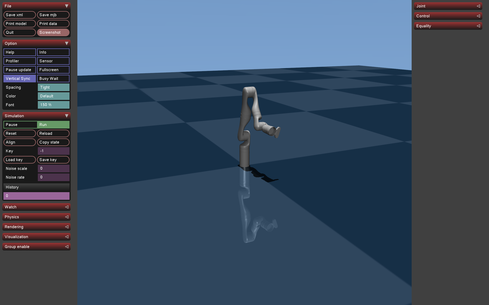

# mjkdl

[](https://github.com/vamsikalagaturu/mjkdl/actions/workflows/build.yml)
[](https://github.com/vamsikalagaturu/mjkdl/actions/workflows/tests.yml)
[](https://github.com/vamsikalagaturu/mjkdl/actions/workflows/docs.yml)
[](https://github.com/vamsikalagaturu/mjkdl/actions/workflows/python.yml)
[](https://github.com/vamsikalagaturu/mjkdl/actions/workflows/ros2.yml)

[MuJoCo](https://github.com/google-deepmind/mujoco) physics with
[Orocos KDL](https://github.com/orocos/orocos_kinematics_dynamics) kinematics and dynamics,
in C++ and Python.

<table>
<tr>
  <td align="center"><br/><b>ex_gravity_comp</b> &mdash; Single arm, KDL gravity compensation</td>
</tr>
</table>

## Features

- **Scene builder** -- compose MJCF robots, grippers, objects and cameras into one MuJoCo
  scene via `mjSpec`, with ordered attachment chains and relative placement.
- **KDL from the model** -- the KDL chain is built from the compiled MuJoCo model; several
  robots, each with its own chain, share one simulation.
- **Control** -- POSITION / VELOCITY / TORQUE ports, each mode a group of MuJoCo actuators
  ([torque control](docs/howto/torque_control.md)), plus KDL FK, IK, RNEA and ACHD solvers.
- **One `Env`** -- owns the model, robots, scene slots and viewer; `step` / `update` /
  `reset` drive it, and reset re-seeds everything it holds.
- **Viewer and recording** -- the MuJoCo Simulate UI with Frames / Trace / Perturb panels,
  and interactive or headless (EGL + ffmpeg) MP4 capture.
- **Python bindings** -- the same `Env`, `Robot`, `Viewer` and `VideoRecorder`, returning
  PyKDL types and numpy arrays.

## Install

Ubuntu/Debian, CMake >= 3.16, a C++20 compiler and, for Python, Python >= 3.10. MuJoCo 3.14.0
is downloaded by the build; the secorolab Orocos KDL fork is built from source (`mjkdl.repos`)
and the system KDL is never used.

```bash
sudo apt install cmake g++ git python3-dev python3-venv vcstool \
  libeigen3-dev libglfw3-dev libgl-dev libegl-dev ffmpeg

git clone https://github.com/vamsikalagaturu/mjkdl.git && cd mjkdl
vcs import < mjkdl.repos            # the KDL fork, into third_party/
```

`main` only advances at releases, so a plain clone is the latest release; `--branch vX.Y.Z`
pins an older one. `vcstool` is also on PyPI; ROS apt sources name it `python3-vcstool`.

**C++**

```bash
cmake -B build -DCMAKE_BUILD_TYPE=RelWithDebInfo
cmake --build build --parallel $(nproc)
cmake --install build               # optional: find_package(mjkdl) or pkg-config mjkdl
./build/src/examples/ex_table_pick_place
```

**Python**

```bash
uv pip install .
python python/mjkdl/examples/ex_table_pick_place.py --gui
```

The wheel bundles the KDL fork, PyKDL, the MuJoCo plugins and the `assets/` models; MuJoCo
itself comes from the pinned `mujoco` pip package.

**ROS 2 (colcon)**, Jazzy or Lyrical, with KDL as its own package so the overlay shares one
`liborocos-kdl`:

```bash
mkdir -p ~/ros2_ws/src && cd ~/ros2_ws
git clone https://github.com/vamsikalagaturu/mjkdl.git src/mjkdl
vcs import src < src/mjkdl/mjkdl.repos
source /opt/ros/jazzy/setup.bash
colcon build --packages-select orocos_kdl --cmake-args -DENABLE_TESTS=OFF
source install/setup.bash
colcon build --packages-select mjkdl --cmake-args -DMJKDL_OROCOS_KDL_FROM_PACKAGE=ON
```

The [standalone](docs/install/standalone.md) and [ROS 2](docs/install/ros2.md) guides cover
tests, editable Python installs, a custom MuJoCo or KDL, sharing one KDL across projects and
every CMake option.

## Assets

The bundled models ship in the repo and the wheel. C++ examples and tests load them from the
source `assets/` (`mjkdl_examples::asset(...)`), Python from the installed package
(`mjkdl.ASSETS_DIR / "..."`), and `cmake --install` copies them into `~/.cache/mjkdl/assets`
for programs that know neither.

| Path | Description |
|------|-------------|
| `assets/kinova_gen3/gen3.xml` | Kinova Gen3; MuJoCo Menagerie's model plus a base_link/shoulder_link contact exclusion and Kinova's joint armature |
| `assets/robotiq_2f85/2f85.xml` | Robotiq 2F-85; ctrl is the driver joint angle, 0 (open) to 0.82 rad (closed). Use `tool_body = "g_base_mount"` (with prefix `g_`): the mount carries mass too |
| `assets/ft_sensor.xml` | 6-axis force-torque sensor |
| `assets/table.xml` | Table with an authored `table_top` site |
| `assets/mug.xml`, `assets/mug_table.xml` | Pouring example |
| `assets/cabinet/cabinet.xml` | Three-drawer cabinet |
| `assets/cube.xml` | Free cube |
| `assets/door_latch/door_latch.xml` | Latched cupboard door (not used by the examples or tests) |

Any other MJCF, e.g. from [MuJoCo Menagerie](https://github.com/google-deepmind/mujoco_menagerie),
loads through `RobotSpec.path`; a model that brings its own floor needs `add_floor = false`.

## Examples and tests

Each example exists in C++ (`src/examples/`) and Python (`python/mjkdl/examples/`) and ends by
itself; the C++ ones open the viewer unless given `--headless`, the Python ones run headless
unless given `--gui`. The catalog is in [docs/examples.md](docs/examples.md).

```bash
ctest --test-dir build --output-on-failure      # see test/README.md
```

## Documentation

- [C++ tutorial](docs/tutorials/cpp.md) and [C++ API guide](docs/api/cpp.md)
- [Python tutorial](docs/tutorials/python.md) and [Python API guide](docs/api/python.md)
- [Conventions](docs/conventions.md) -- units, frames, quaternion order, F/T sign, what persists
- [Torque control](docs/howto/torque_control.md), [loop pacing](docs/howto/loop_pacing.md)
- Migration notes between versions: [docs/index.md](docs/index.md)
- Generated API reference: `cmake -B build -DBUILD_DOCS=ON && cmake --build build --target docs`,
  then `build/docs/html/index.html`
